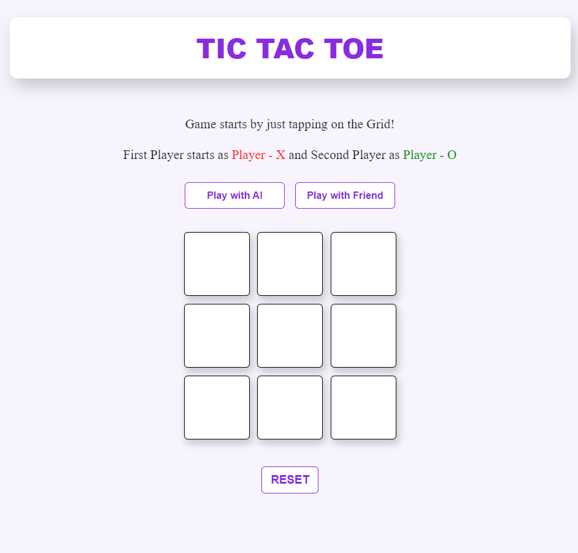

# TIC-TAC-TOE Game

Welcome to the TIC-TAC-TOE game project! This project is a classic implementation of the TIC-TAC-TOE game, allowing players to play against each other or an AI with varying difficulty levels. 

The game is built using HTML, CSS, and JavaScript.

## 📜 Overview

TIC-TAC-TOE is a two-player game where players take turns to mark spaces in a 3x3 grid. The first player to get three of their marks in a row, column, or diagonal wins the game. This implementation supports:
- **Player vs. Player:** Play against a friend.
- **Player vs. AI:** Challenge an AI with three difficulty levels: Easy, Medium, and Hard.

## 🚀 Features

- **Interactive Grid:** Click to make a move. The grid updates dynamically based on user actions.
- **AI Opponents:** Three levels of AI difficulty:
  - **Easy:** Random moves.
  - **Medium:** Strategic moves to win or block the opponent.
  - **Hard:** Optimal play using the Minimax algorithm.
- **Responsive Design:** Mobile-friendly UI adjustments.
- **Visual Feedback:** Game status updates and highlight winning cells.

## 📸 Screenshots



## 🎮 How to Play

1. **Choose Game Mode:**
   - Click "Play with AI" to compete against an AI.
   - Click "Play with Friend" to play with another person.

2. **Select AI Difficulty (if playing with AI):**
   - **Easy:** AI makes random moves.
   - **Medium:** AI uses a strategy to win or block.
   - **Hard:** AI uses advanced algorithms for optimal play.

3. **Take Turns:**
   - Click on any cell in the grid to make a move.
   - The game will alternate between Player X and Player O.

4. **Game End:**
   - The game will announce a win or a tie when the game ends.

5. **Reset the Game:**
   - Click the "RESET" button to start a new game.

## 📁 Project Structure

tic-tac-toe/
│
├── index.html       # Main HTML file
├── tic.css          # Stylesheet for the game
└── tic.js           # JavaScript file for game logic and AI


## 💻 Getting Started

To run the TIC-TAC-TOE game locally:

1. **Clone the Repository:**

   ```bash
   git clone https://github.com/yourusername/tic-tac-toe.git

2. **Navigate to the Project Directory:**

   cd tic-tac-toe

3. **Open the index.html file in a web browser:**

   You can do this by double-clicking the file or using a local server.


## 📝 License

This project is licensed under the MIT License.

